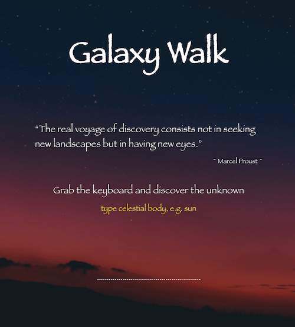

# galaxy-walk

This is my first project in Vue.js which uses NASA image API to fetch images and display them after passing 
search query. 
Enter the name of any celestial body, e.g. Sun, Mercury etc.

## Running the app:
If you want to see, get on a rocket, fasten your seat belt and click 
https://distracted-haibt-6fb73c.netlify.app

## Project setup
```
yarn install
```

### Compiles and hot-reloads for development
```
yarn serve
```

### Compiles and minifies for production
```
yarn build
```

### Run your unit tests
```
yarn test:unit
```

### Lints and fixes files
```
yarn lint
```

### Customize configuration
See [Configuration Reference](https://cli.vuejs.org/config/).


